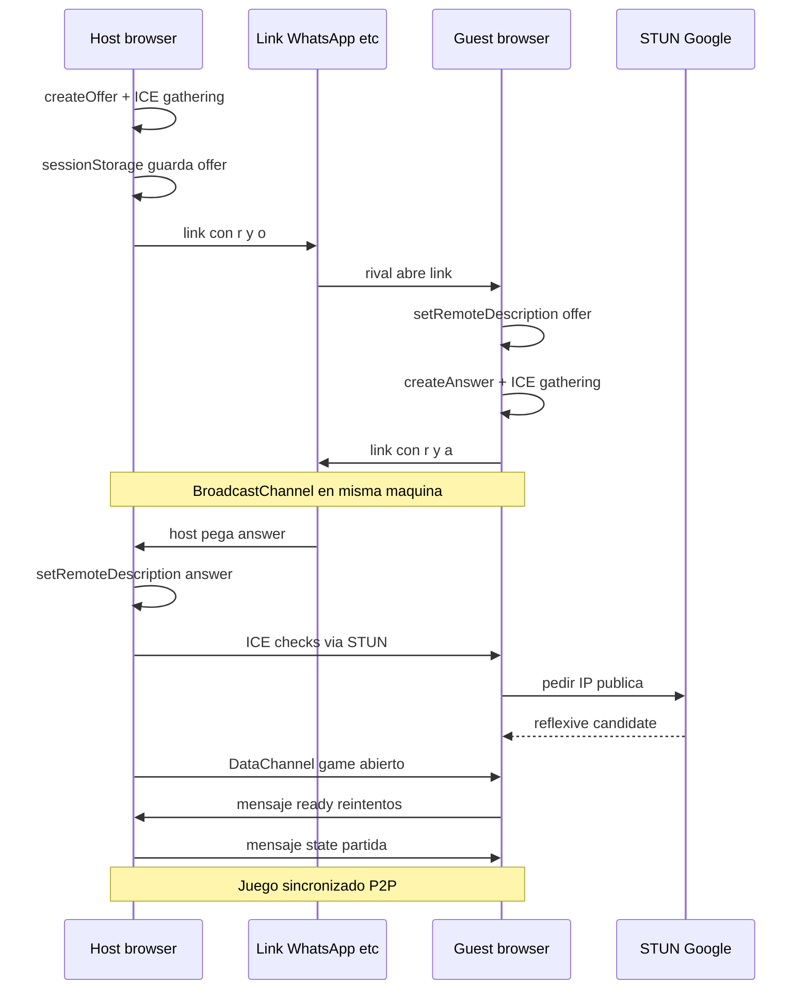
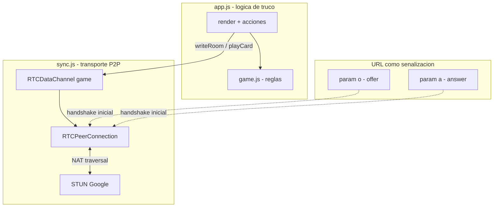

# Truqui

**Truco argentino online, peer-to-peer.** Sin servidor de juego, sin base de datos, sin cuenta.

Compartís un link, el rival te devuelve otro, y los dos navegadores se hablan directo por WebRTC. La partida entera — cartas, envido, truco, chat — vive en el cable entre vos y tu rival.


---

## TL;DR — cómo jugar

1. **Host** → *Iniciar partida* → copiá el link de invitación
2. **Rival** → abre ese link → copia el **link de respuesta** y se lo manda al host
3. **Host** → pega el link de respuesta → *Conectar*
4. **A jugar** → envido, truco, retruco, vale 4. Primero en **30 puntos** gana

> Si probás en la **misma compu** (dos pestañas), el answer a veces llega solo vía `BroadcastChannel`. Entre celular y compu, hay que pasar el link a mano (WhatsApp, Telegram, lo que sea).

---

## La magia: P2P con el link como señalización

Acá está el chiste entero. WebRTC necesita un **intercambio previo** de metadatos (SDP + candidatos ICE) antes de que dos browsers puedan hablar. Eso normalmente lo hace un servidor de señalización (Socket.io, Firebase, lo que sea).

**Nosotros no tenemos ese servidor.**

En cambio, empaquetamos la descripción de sesión WebRTC **dentro del URL** y la pasamos de mano en mano como si fuera un código de invitación. El link *es* la señalización.

### Anatomía del link

```
https://truqui.pages.dev/?r=22148bcc&o=eyJ0eXBlIjoib2ZmZXIiLC...
│                         │          │
│                         │          └── SDP del host (offer), base64url
│                         └── ID de sala (8 chars, UUID recortado)
└── origen estático (Cloudflare Pages)
```

| Param | Quién lo genera | Qué contiene |
|-------|-----------------|--------------|
| `r` | Host al crear partida | Room ID. Identifica la sesión P2P en memoria local |
| `o` | Host (`createInvite`) | **Offer** WebRTC empaquetado: `{ type, sdp }` con candidatos ICE ya recolectados |
| `a` | Rival (`joinInvite`) | **Answer** WebRTC empaquetado, misma estructura |

El rival abre `?r=…&o=…`, construye su `RTCPeerConnection`, genera el answer y te devuelve un link con `&a=…`. El host lo consume y listo: handshake completo.

**¿Por qué query string (`?`) y no hash (`#`)?**  
Probamos ambos caminos. El SDP + ICE en un link argentino real puede pesar **varios KB**. Con query params:

- Safari y Chrome parsean URLs largas de forma predecible al copiar/pegar
- El host puede pegar el link de respuesta del rival en un input y parsearlo con `URL` + fallback a hash
- `history.replaceState` actualiza la barra del host sin recargar

(`parseUrlParams` en `sync.js` lee **search y hash**, por si el link llega en cualquiera de los dos formatos.)

### Empaquetado: `pack` / `unpack`

El SDP no es texto amigable para un URL. Lo serializamos así:

```
RTCSessionDescription  →  JSON.stringify  →  UTF-8 bytes  →  base64  →  base64url (-/_ sin padding)
```

```js
// sync.js — idea general
function pack(obj) {
  const json = JSON.stringify(obj);
  const bytes = new TextEncoder().encode(json);
  return btoa(...).replace(/\+/g, '-').replace(/\//g, '_').replace(/=+$/, '');
}
```

Base64url evita que `+`, `/` y `=` rompan el query string. Al abrir el link, `unpack` revierte el proceso y reconstruye el `RTCSessionDescription`.

---

## Diagrama: flujo completo



---

## Diagrama: capas WebRTC



---

## Paso a paso en el código

### 1. Host crea la partida (`startPartida` → `createInvite`)

```text
RTCPeerConnection(STUN)
  └─ createDataChannel("game", { ordered: true })   ← canal de juego
  └─ createOffer() → setLocalDescription()
  └─ waitIce()                                       ← esperamos candidatos ICE
  └─ pack(localDescription) → &o= en el URL
  └─ sessionStorage["truqui-host-{r}"] = offer     ← por si recargás
```

El host **no espera al rival** para generar el link. El offer ya trae todo lo que el guest necesita para contestar.

### 2. Rival acepta (`joinFromInvite`)

```text
unpack(&o=) → setRemoteDescription(offer)
createAnswer() → setLocalDescription()
waitIce()
pack(localDescription) → link con &a=
BroadcastChannel.postMessage({ answer })            ← atajo misma máquina
```

### 3. Host conecta (`acceptAnswer`)

```text
restoreHost() si hace falta (sessionStorage)
unpack(&a=) → setRemoteDescription(answer)
connectionState → "connected"
DataChannel.onopen → fireOpen()
```

Si el host recargó la pestaña, reconstruye el `PeerConnection` desde el offer guardado en `sessionStorage` y solo necesita el answer del rival.

### 4. Arranque del juego (`onP2POpen`)

Cuando el canal abre:

| Rol | Qué hace |
|-----|----------|
| **Host** | Crea `newGameState()`, reparte cartas, manda `{ type: "state" }` |
| **Guest** | Manda `{ type: "ready" }` (y reintenta a 500 ms y 1500 ms por si el host aún no está listo) |

El guest **nunca** autoriza la partida: siempre pide sync al host. Evita estados divergentes.

### 5. Durante la partida

Todo mensaje va por el `DataChannel` como JSON:

| `type` | Dirección | Payload |
|--------|-----------|---------|
| `state` | bidireccional (quien mueve escribe) | `{ scores, hand, players, updatedAt, … }` |
| `chat` | bidireccional | `{ text, from, ts }` |
| `ready` | guest → host | pedido de snapshot inicial |

**Resolución de conflictos:** `render()` ignora estados con `updatedAt` menor o igual al último aplicado. El último write gana — suficiente para turnos alternados de truco.

---

## STUN: por qué hace falta (y por qué no alcanza un TURN)

La mayoría de la gente está detrás de NAT (router de casa, 4G, etc.). Dos browsers no se ven las IPs privadas mutuamente.

**STUN** (`stun.l.google.com`) le dice a cada peer: *"desde afuera, tu IP:puerto es X"*. Esos **candidatos reflexivos** van embebidos en el SDP del offer/answer.

```js
const STUN = {
  iceServers: [
    { urls: 'stun:stun.l.google.com:19302' },
    { urls: 'stun:stun1.l.google.com:19302' },
  ],
};
```

Con suerte, WebRTC encuentra un camino **directo** (UDP hole punching). Si ambos están en redes simétricas muy cerradas, puede fallar — ahí entraría un **TURN relay** (servidor que reenvía tráfico). Truqui hoy **no usa TURN** a propósito: cero infra, cero costo. En la práctica funciona bien en la mayoría de casas; en redes corporativas duras a veces no.

---

## Roles: host vs guest

| | Host (`p2p.role === 'host'`) | Guest |
|---|------------------------------|-------|
| Slot | Jugador 0 | Jugador 1 |
| Crea partida | ✅ | ❌ |
| Reparte cartas | ✅ | ❌ |
| Botón "Siguiente mano" | ✅ | ❌ |
| Fuente de verdad del estado | ✅ | recibe sync |

El slot **no** se infiere del `localStorage` compartido entre pestañas: se fija por rol P2P. (Dos pestañas en el mismo browser comparten `playerId` — sin esto, las manos se mezclaban.)

---

## Atajos y edge cases

### Misma computadora, dos pestañas

`BroadcastChannel("truqui-{roomId}")` — cuando el guest genera el answer, lo postea ahí. Si el host escucha en la misma máquina, recibe el SDP sin copiar/pegar.

### Host recarga la pestaña

`sessionStorage["truqui-host-{r}"]` guarda el offer. Al volver con `?r=…&o=…` y flag `truqui-role-{r}=host`, `restoreHostSession()` reconstruye el PC.

### Link con solo `&a=` (host abre respuesta del rival)

Soportado: el boot en `app.js` detecta `link.a`, llama `acceptAnswer` y conecta si la sesión host sigue viva.

### Link incompleto (`?r=…` sin `o` ni `a`)

Muestra error claro: hace falta el offer del host.

---

## Reglas implementadas

| | |
|---|---|
| Mazo | Español, 40 cartas |
| Mano | 3 cartas, 3 bazas |
| Envido | Envido (2), Real envido (3), Falta envido — antes de la 1.ª carta |
| Truco | Truco (2), Retruco (3), Vale 4 (4) |
| Partida | Primero en **30 puntos** gana |
| Mano | Alterna cada mano (desempate de envido) |

---

## Arquitectura de archivos

```text
truqui/
├── index.html      UI + SEO + boot por query params
├── app.js          Orquestación: lobby, render, acciones, writeRoom
├── game.js         Reglas puras de truco (sin DOM, sin red)
├── sync.js         WebRTC: pack/unpack, offer/answer, DataChannel
├── style.css       Estética retro 1985
├── img/palos/      Íconos de palo (espada, basto, oro, copa)
└── img/dorso.png   Reverso de carta
```

**Separación clave:** `game.js` es determinista y testeable. `sync.js` solo mueve bytes. `app.js` los une.

---

## Correr local

```bash
npm start
```

Abrí http://localhost:3000

> WebRTC en `localhost` funciona sin HTTPS. En producción hace falta **HTTPS** (Cloudflare Pages lo trae gratis).

---

## Deploy en Cloudflare Pages

Sitio 100% estático. Sin Workers, sin Functions, sin build step.

### CLI

```bash
npm install
npx wrangler login
npm run deploy
```

### Dashboard

| Campo | Valor |
|-------|-------|
| Framework preset | None |
| Build command | *(vacío)* |
| Build output directory | `/` |

---

## Stack

| Capa | Tecnología |
|------|------------|
| UI | HTML / CSS / JS vanilla |
| Reglas | `game.js` — sin frameworks |
| Red | WebRTC `RTCDataChannel` |
| NAT | STUN Google (gratis) |
| Señalización | **URL query params** (`o`, `a`) |
| Deploy | Cloudflare Pages |
| Fuentes | Press Start 2P + VT323 |

**Sin** React, sin Node en runtime, sin WebSocket server, sin base de datos.

---

## ¿Por qué esto escala a "sacarlo del estadio"?

1. **Costo marginal ≈ $0** — servir HTML estático en CF Pages; el tráfico de juego no pasa por vos
2. **Privacidad real** — ni cartas ni chat tocan un backend tuyo
3. **Latencia mínima** — UDP directo entre peers, no round-trip a un datacenter
4. **Deploy = git push** — no hay estado de servidor que migrar
5. **El link es el protocolo** — cualquier canal (WhatsApp, QR, AirDrop) sirve de señalización

El trade-off consciente: **dos links** para conectar y **sin TURN** para redes imposibles. Para truco entre amigos en Argentina, es un bargain excelente.

---

## Licencia / créditos

Hecho con ♥ para la mesa virtual. Si te copiás la idea del link-as-signaling, mandá un truco.
