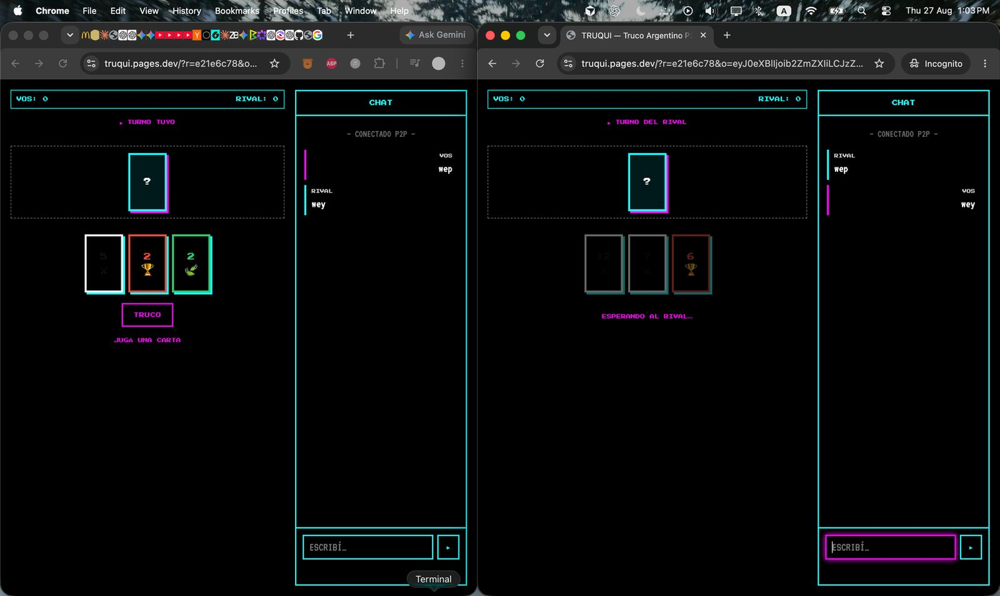

# Truqui

Truco argentino online, **peer-to-peer**. Sin servidor, sin base de datos, sin cuenta.

Abrís el link, compartís otro link, y jugás directo con tu rival.



---

## ¿Qué es P2P acá?

**P2P** (peer-to-peer) significa que los dos navegadores se hablan **directo entre sí**. No hay un backend guardando la partida, no hay relay, no hay API.

```
  Host                         Rival
   │                             │
   │  1. Link de invitación      │
   │  (con offer WebRTC)         │
   ├────────────────────────────►│
   │                             │
   │  2. Link de respuesta       │
   │  (con answer WebRTC)        │
   │◄────────────────────────────┤
   │                             │
   │  3. Conexión directa        │
   │◄════ WebRTC DataChannel ═══►│
   │     (cartas, truco, etc.)   │
```

La info para conectarse viaja **en el link** (`&o=` invitación, `&a=` respuesta). Una vez conectados, el juego entero se sincroniza por **WebRTC** — browser a browser.

### ¿Por qué así?

- **Cero infraestructura** — es HTML + JS estático, deployable en Cloudflare Pages gratis
- **Privacidad** — tu partida no pasa por ningún server nuestro
- **Simple** — no hay login, no hay salas en la nube

El trade-off: hay que intercambiar dos links (invitación + respuesta). Es el precio de no depender de un relay.

---

## Cómo jugar

1. **Host** — tocá *Iniciar partida* y copiá el link de invitación
2. **Rival** — abrí ese link, copiá el **link de respuesta** y mandáselo al host (WhatsApp, Telegram, lo que sea)
3. **Host** — pegá el link de respuesta y tocá *Conectar*
4. **A jugar** — cartas, truco, retruco, vale 4

> En la misma computadora (dos pestañas del mismo browser), el link de respuesta a veces se manda solo. Entre browsers distintos, hay que pasarlo manualmente.

---

## Reglas (versión simple)

| | |
|---|---|
| Mazo | Español de 40 cartas |
| Mano | 3 cartas por jugador, 3 bazas |
| Puntos | Truco (2), Retruco (3), Vale 4 (4) |
| Partida | Primero en **30 puntos** gana |

---

## Correr local

```bash
npm start
```

Abrí http://localhost:3000

---

## Deploy en Cloudflare Pages

Sitio 100% estático. No necesitás Workers ni Functions.

### Por CLI

```bash
npm install
npx wrangler login
npm run deploy
```

### Por dashboard

Conectá el repo en [Cloudflare Pages](https://dash.cloudflare.com/?to=/:account/pages):

| Campo | Valor |
|-------|-------|
| Framework preset | None |
| Build command | *(vacío)* |
| Build output directory | `/` |

---

## Stack

- HTML / CSS / JS vanilla
- WebRTC DataChannel para sync P2P
- STUN de Google para atravesar NAT
- Deploy: Cloudflare Pages

Sin frameworks, sin build step, sin backend.
